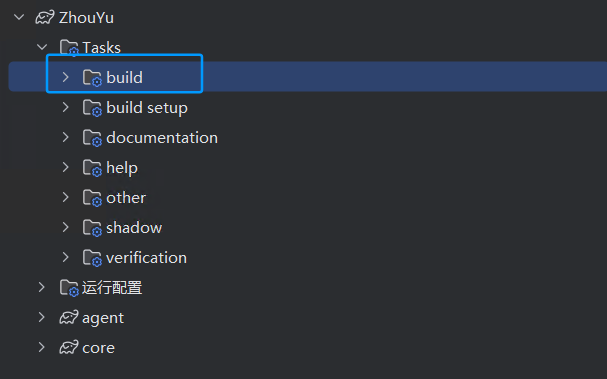

# 说明

原来的依赖有点问题不能直接下了，把它改为本地依赖的形式，直接IDEA导入构建就行了

JDK为`1.8`，IDEA版本为 `2024.2.3` ，gradle版本就用的IDEA的

代码在Release那里，下载 `ZhouYu.zip` ，不想下载下来编译的就直接下我编译好的Jar包就行了

构建好的JAR包有三个，参考原本项目的ReadMe，ZhouYu内存马为 `agent-1.0-SNAPSHOT-all.jar`

# 原本项目地址

https://github.com/threedr3am/ZhouYu
